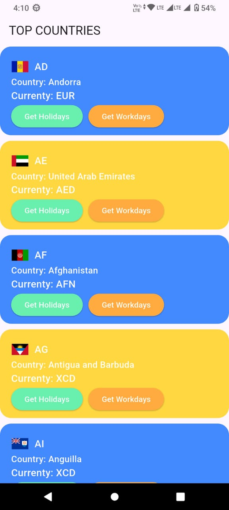
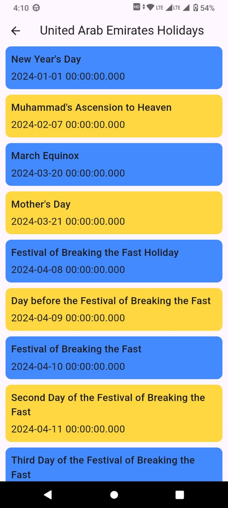
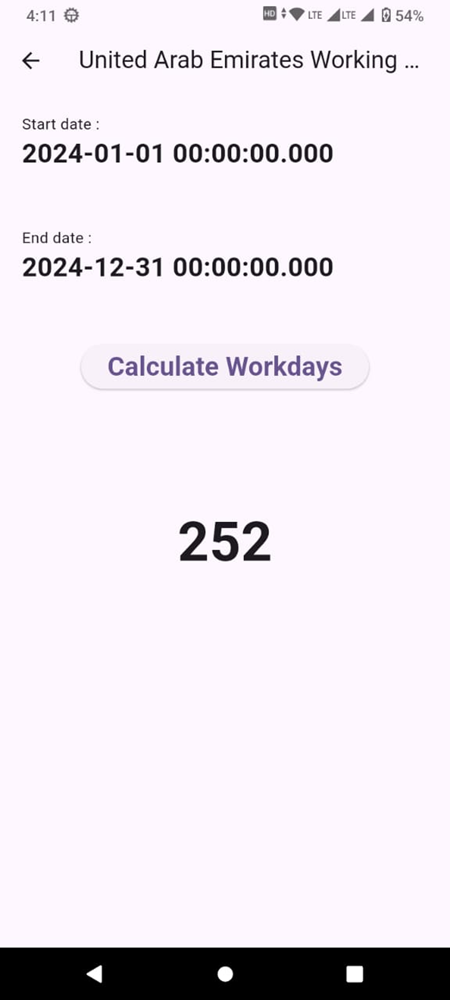

# Work Holiday App

A Flutter application designed to demonstrate API integration and working day calculations. This project interacts with the **Holiday API** to fetch country data, public holidays, and calculate business days between dates.

## 🚀 Features

*   **Country Listing:** Fetches and displays a list of supported countries from the API.
*   **Holiday Calendar:** View public holidays for a specific country (currently set to 2024 for API free tier compatibility).
*   **Working Days Calculator:** select a start and end date to calculate the total number of working days, excluding weekends and holidays.

## 🛠️ Tech Stack

*   **Framework:** [Flutter](https://flutter.dev/)
*   **State Management:** [Provider](https://pub.dev/packages/provider)
*   **Networking:** [http](https://pub.dev/packages/http)
*   **Environment Variables:** [flutter_dotenv](https://pub.dev/packages/flutter_dotenv)

## ⚙️ Setup & Installation

1.  **Clone the repository:**
    ```bash
    git clone https://github.com/milanrnw/WORK_HOLIDAY.git
    cd work_holiday
    ```

2.  **Install Dependencies:**
    ```bash
    flutter pub get
    ```

3.  **Environment Configuration:**
    *   Create a `.env` file in the root directory.
    *   Add your API key and Base URL from [Holiday API](https://holidayapi.com/):
        ```env
        API_KEY=your_api_key_here
        BASE_URL=https://holidayapi.com/v1/
        ```

4.  **Run the App:**
    ```bash
    flutter run
    ```

## 📱 Screens

1.  **Countries Screen:** The home screen displaying a list of countries.
2.  **Holiday Screen:** Shows the list of holidays for the selected country.
3.  **Working Days Screen:** A tool to calculate business days between two selected dates.

## � Screenshots

| Countries Screen | Holiday Screen | Working Days Screen |
|:---:|:---:|:---:|
|  |  |  |


## �📝 Note

This project is primarily for **API testing and demonstration purposes**. 
*   **Year Limitation:** Due to the free tier limitations of the Holiday API, holiday data fetching is currently hardcoded to the year **2024**.
